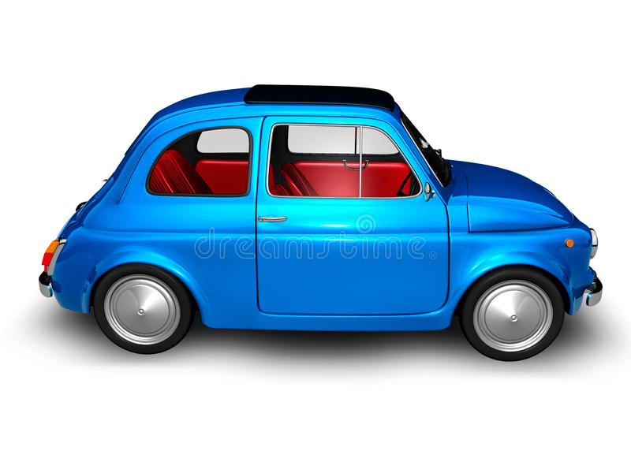
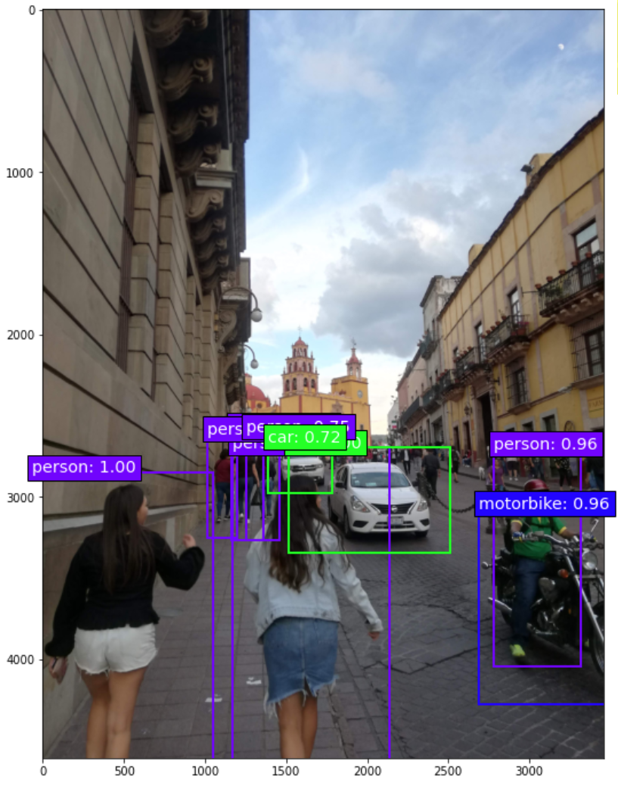

============================
Contexto
============================

Repositorio: `CustumObjectDetection <https://github.com/Daegas/CustumObjectDetection>`_ 

El fin de esta sección es compilar información básica para entender el proceso
de entrenamiento del modelo.

Redes Neuronales Convolucionales (CNN)
----------------------------------------
Las CNN fueron introducidas por primera vez por Yann LeCun 1998 en 
`Gradient-Based Learning Applied to Document Recognition <https://pdfs.semanticscholar.org/62d7/9ced441a6c78dfd161fb472c5769791192f6.pdf>`_
y resultaron ser muy efectivas en reconocimiento de imágenes y clasificación.

👁 `¿Pero qué "es" una Red neuronal? <https://www.youtube.com/watch?v=aircAruvnKk>`_

Cómo se ve en el video una red neuronal está compuesta por capas, cada capa contiene un vector de
características que conservan una relación espacial entre pixeles.
Dada una imagen en forma de matriz:

*  👁 `Explicación Visual Kernels <https://setosa.io/ev/image-kernels/>`_ 

Se aplican filtros para resaltar bordes, circunferencias, esquinas, etc. Esta técnica para detectar las partes más importantes de una imagen se llama "convolución"  

* 👁 `Descenso de gradiente, es como las redes neuronales aprenden <https://www.youtube.com/watch?v=IHZwWFHWa-w&t=660s>`_

Con el descenso de gradiente se buscar calcular cuales valores de pesos y bias minimizan el costo, la distancia del resultado obtenido en la última capa con el resultado esperado.

* 👁 `¿Qué es la retropropagación y qué hace en realidad? <https://www.youtube.com/watch?v=Ilg3gGewQ5U>`_

Cada neurona en la penúltima capa necesita unos ajustes de parámetros (bias, pesos) para que en la última capa (salida) las neuronas más activas correspondan a las que se esperan estén más activas. Se agregan todos los ajustes de todas las neuronas de esa penúltima capa, luego se hace lo mismo con la antepenúltima y así hasta llegar a la segunda capa (la primera es la entrada). A eso se le llama "retropropagación".

**Otros datos:**

* 👁 `Funciones de Activación <https://www.i2tutorials.com/activation-functions-in-deep-learning/>`_

Cada neurona toma la una entrada, la multiplica por el peso, le agrega el bias y el resultado lo pasa por una función de activación, que son funciones que determinan si una neurona debe o no ser activada. Ayudan a normalizar en un rango [0 , 1] o [-1 , 1] Existen muchos tipos de funciones de activación (Sigmoid, ReLU, TanH, LeakyReLU, Softmax, etc) 

* Capas

El propósito de cada capa varia, a veces pueder ser reducir dimensionalidad (pooling), detectar patrones (convolución) entre otras funciones.

* 👁 `Arquitecturas <https://medium.com/analytics-vidhya/cnns-architectures-lenet-alexnet-vgg-googlenet-resnet-and-more-666091488df5>`_

Existen muchas arquitecturas, es decir cuantas capas, de que tipo y en que acomodo se usan en una red. Hay arquitecturas de redes neuronales que no tienen convolución, generalmente las usadas en reconocimiento y clasificación de imágenes si tienen. Algunas arquitecturas muy famosas de CNN especiales para detectar patrones visuales son VGG, Inception, RESNET.

* 👁 `Aquí <https://www.cs.cmu.edu/~aharley/vis/conv/flat.html>`_ puedes encontrar un ejemplo interactivo y visual de una CNN para  reconocimiento de dígitos.

.. note::  No te preocupes si no entiendes al 100% todos los links o su teminología, pero para los videos se recomienda verlos un par de veces para comprender los conceptos, ya que es la base del aprendizaje.

Detección de Objetos
---------------------
De acuero con `wikypedia <Área relacionada con la visión artificial y el procesamiento de imagen que trata de detectar casos de objetos semánticos de una cierta clase (como humanos, edificios, o coches) en vídeos e imágenes digitales.​>`_
la detección de objetos es: Área relacionada con la visión artificial y el procesamiento de imagen que trata de detectar casos de objetos semánticos de una cierta clase (como humanos, edificios, o coches) en vídeos e imágenes digitales.​

Es diferente un problema de clasificación cómo:

[#f1]_

Donde es una sola clase en toda la imagen; a un problema de reconocimiento y clasificación como:

.. figure:: img/or.png
    :width: 200px
    :align: left 

Que son varias instancias de varias clases en una sola imágen. Como podemos ver, para
el segundo ejemplo es necesario definir qué objeto se encuentra y que región ocupa
dentro de la imagen.
Algunas arquitecturas que se usan para problemas como el segundo ejemplo son:

* Region Based Object Detectors como R-CNN, Fast RCNN, Faster R-CNN, R-FCN, FPN You can learn a bit more 👁 `here <https://medium.com/@jonathan_hui/what-do-we-learn-from-region-based-object-detectors-faster-r-cnn-r-fcn-fpn-7e354377a7c9>`_

Estas usan una ventana que mueven por toda la imagen, esta imagen de la ventana se ajusta a un tamaño fijo 
y a cada una se le aplica un clasificador. Para reducir el número de operaciones, se usan métodos
que proponen Regiones de Interés o  *Regions of Interest* (ROIs) o una red completa como *Region Proposal Network*
o RPN, que reducen el número de ventanas a analizar,
lo cuál se traduce en menor tiempo de entrenamiento. Pero para región se hacen *k* propuestas de región
por clase. El número de operaciones que se hacen sigue siendo elevado.

* 👁 `Single Shot Detectors como YOLO y SSD <https://medium.com/@jonathan_hui/what-do-we-learn-from-single-shot-object-detectors-ssd-yolo-fpn-focal-loss-3888677c5f4d>`_

Cómo se explica en el link, estas arquitecturas calculan al mismo tiempo un *boundary box* y la clase. Estos resultan ser buenos en procesamiento en tiempo real, pero tienenalgunos problemas
para detectar objetos o muy cercanos o muy lejanos.

Uno de los grandes problemas en detección de objetos y en general de Machine Learning,
es la selección del modelo. Esto se resuleve muchas veces de manera empírica o por
prueba y error. Vamos a tratar de implementar YOLO y SSD, sin dejar de tomar como opciones
otras arquitecturas.

Documentación YOLO y SSD:

* `Página oficial YOLO <https://pjreddie.com/darknet/yolo/>`_

* `Artículo YOLO <https://arxiv.org/abs/1506.02640>`_

* `Artículo SSD <https://arxiv.org/abs/1512.02325v5>`_

   
¿Cómo se implementan?
---------------------------
Primero debemos configurar nuestro ambiente de desarrollo. Cómo se explicó en la Introducción este fue
implentado en Ubuntu 18.04. Lo que ocupamos:

* `Anaconda <https://www.anaconda.com/>`_ : Aunque no es totalmente necesaria, es súper útil para crear ambientes con diferentes especificaciones. Además tiene otras herremientas útiles para trabajar. Una alternativa es pipenv. 

* `Tensorflow <https://www.tensorflow.org/>`_ Es una plataforma que contiene herramientas, librerías y recursos que permiten a los desarrolladores introducirse al estado del arte en Machine Learning.​ La implementación de arquitecturas de redes neuronales es relativamente fácil. ​Con 3 líneas de código es posible agregar capas. Basta con cambiar las entradas (placeholders) para usar en otras aplicaciones.​

* `Keras <https://keras.io/>`_  es un API de alto nivel escrita en python para redes neuronales, permite trabajar por encima de Tensorflow. Ideal para hacer prototipos fáciles y rápidos.​ Usa el backend de tensorflow y tiene ya implementadas capas que son comunes en muchas arquitecturas​

Es recomendable tener una tarjeta gráfica para el entrenamiento. 
Aunque se puede usar solo CPU, los tiempos de entrenamiento aumentan muy considerablemente.

Tensorflow tiene soporte para CPU y GPU, es mil vices más recomendable GPU, para la instalación 
de cualquiera de los dos se puede hacer por comandos pip o usando una imagen de docker. Nuevamente lo ideal
y en teoría más sencillo es con una imagen de docker, pues solo se tienen que instalar los drivers manualmente.

.. rubric:: Footnotes

.. [#f1] https://thumbs.dreamstime.com/b/old-fiat-500-1-13471810.jpg