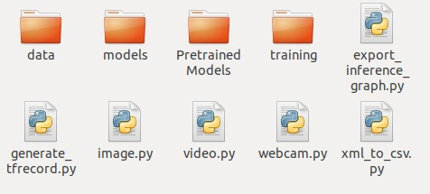
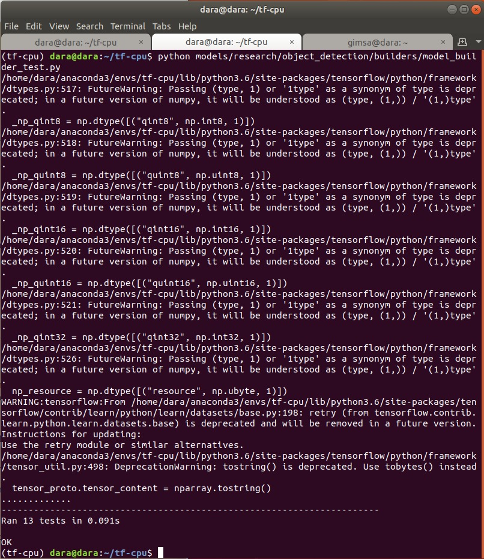

=============================
Instalación
=============================

Repositorio: `CustumObjectDetection <https://github.com/Daegas/CustumObjectDetection>`_ 

Brief Summary
==============

Última actualización: 28/11/2020 con TensorFlow v1.7. 

Pripalmente está basado en
`el repositorio de EdjeElectronics <https://github.com/EdjeElectronics/TensorFlow-Object-Detection-API-Tutorial-Train-Multiple-Objects-Windows-10>`_
y
`el de Khaivdo <https://github.com/Khaivdo/How-to-train-an-Object-Detector-using-Tensorflow-API-on-Ubuntu-16.04-GPU>`__'s
repositories.

.. note:: Se intentó instalar tensorflow para GPU, pero la tarjeta gráfica con que se contaba no era de suficiente capacidad de computo. Se ponen algunos pasos que se intentaron para GPU, pueden ser de utilidad a la hora de la instalación.

​Grabaciones propias
======================
Pueden ser de utilidad en el proceso, también se incluyen más adelante.

#. Instalación y entrenamiento (click => ) `🎞️ <https://www.youtube.com/watch?v=0zRsOIp92NQ>`_.
#. Etiquetado de imagenes (click => ) `📷 <https://youtu.be/E80OEN-_K0M>`_ 

0. Para GPU
============

Para que Tensorflow GPU sea soportado en tu computadora tienes que tomar en cuenta:

* *Hardware*

`Requerimientos de hardware <https://www.tensorflow.org/install/gpu#hardware_requirements>`_

Prácticamente solo es asegurarse que la tarjeta gráfica tenga
disponible CUDA `en esta página <https://developer.nvidia.com/cuda-gpus>`__
y una capacidad de computo >=3.5. En caso de que sea menor a 3.5 
existe la opción de `Build from source <https://www.tensorflow.org/install/source#download_the_tensorflow_source_code>`__
pero eso es un gran reto.

* *Software*

`Los requerimientos de software <https://www.tensorflow.org/install/gpu#software_requirements>`__ de la página oficial de tensorflow.

Lo más importante es:

#. NVIDIA Drivers
#. CUDA toolkit
#. cuDNN SDK

*Puedes saltar este paso en caso de que no se cumplan los requerimientos y tenga que ser TensorFlow CPU. Aunque es mucho^(n) mejor GPU*

Si tienes el hardware correcto hay dos formas de instalar el software y hardware.
Por medio de una imagen de Docker o manualmente. Aquí se hará manualmente,
porque no se encontró contenedor para la versión de la API para CPU. `Pero aquí están los pasos <https://www.tensorflow.org/install/docker>`_, si se quieren
instalar por medio de un contenedor.

0.1 NVIDIA DRIVERS
-------------------
Hay dos formas para instalar los drivers:

#. `la página de NVIDIA <https://www.nvidia.com/drivers>`_
#. Con el comando graphics-drivers ppa

Recomiendo primero intentar la primera. Solo es buscar tu GPU y 
descargar al archivo. Después desde el directorio que lo contiene correr::

    sudo sh ./NVIDIA-Linux-x86_64-418.113.run

O el nombre que tenga el archivo.

Para probar la instalación::

    nvidia-smi

En la salida del comando en la  segunda tabla "Processes" el número correspondiente a tu GPU (usualmente 0)
debe de tener un proceso asignado. 

En caso de que no funcione la instalación, probar la segunda opción.
Se tiene que tomar en cuenta que los drivers de NVIDIA sean compatibles
con la versión de CUDA. `En esta tabla <https://docs.nvidia.com/deploy/cuda-compatibility/index.html#binary-compatibility__table-toolkit-driver>`__
se listan los minimos drivers requeridos para cada versión de CUDA. 
Dependiendo de la versión de Tensorflow es la versión de CUDA que se tiene que instalar. 
Aquí se buscó compatibilidad con tensorflow 1.7, no estoy segura si 

    
`En esta página <https://medium.com/repro-repo/install-cuda-9-2-and-cudnn-7-1-for-tensorflow-pytorch-gpu-on-ubuntu-16-04-1822ab4b2421>`__
en el punto 1 se instalan los drivers via graphics-drivers ppa. Se puede usar como referencia. El paquete para 418 se llama nvidia-driver-418.

::

    sudo apt install nvidia-driver-418 nvidia-settings

con::

    apt-cache search nvidia-driver-

buscas la lista de drivers disponibles para instalar.

`Aquí <https://linuxconfig.org/how-to-install-the-nvidia-drivers-on-ubuntu-20-04-focal-fossa-linux>`__ hay una página de ayuda para Ubuntu 20.04.

0.2 CUDA
---------

Una vez que hayas logrado instalar correctamente los drivers, sigue 
instalar CUDA. Asegúrate de encontrar la version de CUDA compatible con
los drivers instalados.

`CUDA Toolkit archive <https://developer.nvidia.com/cuda-toolkit-archive>`__

Para  CUDA <11 no hay versiones para Ubuntu 20.04 pero se puede usar la
versión estable de 18.04.

En caso de tener problemas:

a) Intentar seguir estás instrucciones pero de la segunda forma (from CUDA repository): `How to install CUDA on Ubuntu 20.04 Focal Fossa Linux <https://linuxconfig.org/how-to-install-cuda-on-ubuntu-20-04-focal-fossa-linux>`_

b) `Guía de instalción oficial de CUDA <https://docs.nvidia.com/cuda/cuda-installation-guide-linux/index.html>`__

c) `Quick Start Guide para Ubuntu <https://docs.nvidia.com/cuda/cuda-quick-start-guide/index.html#ubuntu-x86_64>`__

0.3 cuDNN SDK
----------------

Dependiendo de la versión de CUDA que hayas instalado, elige del 

`archivo de cuDNN <https://developer.nvidia.com/rdp/cudnn-archive>`__

la versión correspondiente. Necesitarás crear una cuenta para descargar.

Abien Fred se tomó la molestía de hacer una guía de instalación de
Tensorflow para Ubuntu 20.04. `Installing TensorFlow GPU in Ubuntu 20.04 <https://towardsdatascience.com/installing-tensorflow-gpu-in-ubuntu-20-04-4ee3ca4cb75d>`__
Puedes seguirlo hasta antes de isntalar Tensorflow.

1. Anaconda
=================

.. note:: 
    `Aquí vienen los pasos <https://docs.anaconda.com/anaconda/install/linux/>`_ , pero básicamente son:

Instalar los requerimientos:

::

    sudo apt-get install libgl1-mesa-glx libegl1-mesa libxrandr2 libxrandr2 libxss1 libxcursor1 libxcomposite1 libasound2 libxi6 libxtst6 -y

Descarga el archivo de instalación con estos comandos, *en el url de la nota, puede estar ya otra versión*:

::

    cd  ~/Desktop
    wget https://repo.anaconda.com/archive/Anaconda3-2020.02-Linux-x86_64.sh
    chmod +x Anaconda3-2020.02-Linux-x86_64.sh 

Y ejecuta:

::

    sh Anaconda3-2020.02-Linux-x86_64.sh -y

Ahora que está instalado,si quieres, puedes borrar el archivo:

::

    rm Anaconda3-2020.02-Linux-x86_64.sh

2. Crear y configurar el ambiente
==================================

Al abrir una nueva terminal debería aparecer *(base)* antes del nombre de usuario.

*En caso de que no, es por qué aún no agarra la configuración. Intentar correr este comando*

::
    
    eval "$(/home//anaconda3/bin/conda shell.bash hook)" conda init 

En caso de que uses una shell diferente, reemplaza *shell.bash* por *shell.<TuShell>* 

2.1 Descargar este repositorio
---------------------------------

Primero crea un directorio, de preferencia, en /home.

.. note:: Aquí se llamo al directorio tf-cpu para que coincida con el nombre del ambiente, pero se puede cambiar el nombre de ambos. Aún no hay diferencias entre CPU y GPU.

:: 

    cd ~ 
    git clone https://github.com/Daegas/CustumObjectDetection
    mv CustumObjectDetection tf-cpu 

.. tip ::
    Se realizó `una grabación 🎞️  <https://www.youtube.com/watch?v=0zRsOIp92NQ>`_  de todo el proceso el cuál, junto con esta guía, se puede seguir. Difiere un poco en los pasos, pero al final quedan igual, de ahora en adelante será denotada por este emoji 🎞️.

Desde tu directorio /tf-cpu, creamos y activamos el ambiente (en `🎞️ <https://www.youtube.com/watch?v=0zRsOIp92NQ>`_ no se ve la activación):

::

    conda env create --file=tf-cpu.yml
    conda activate tf-cpu

Una vez en (tf-cpu), instalar las dependencias, se tiene la opción de una por una, o con el archivo pip-installs.bash, que hace una tras otra *(En la grabación se muestra la salida después de instalar tensorflow)*:

1. Manual

::

    pip install Cython
    pip install contextlib2 
    pip install pillow 
    pip install lxml 
    pip install jupyter 
    pip install matplotlib 
    pip install pandas 
    pip install opencv-python 
    pip install "git+https://github.com/philferriere/cocoapi.git#egg=pycocotools&subdirectory=PythonAPI"

2. Archivo, desde /CustumObjectDetection

::

    chmod +x pip-installs.bash
    ./pip-installs.bash

2.1 Tensorflow en el ambiente
---------------------------------

.. note:: Aquí se instaló la versión 1.7 para CPU siguiendo el repositorio guía.

a)  Version 1.7 de tensorflow para CPU *(Comprobada)*:
::

    pip install tensorflow==1.7 

a)  Version 1.7 de tensorflow para GPU *(No comprobada)*:
::

    pip install tensorflow-gpu==1.7 

b) Instalar la más reciente, ya incluye soporte para GPU o CPU *(Mucho menos comprobada)* :
::

    pip install tensorflow

3. Descargar otros repositorios
================================

Después de terminar el paso 3 , así debe verse tu directorio:

* *data* Contiene las imagenes de entrenamiento y testeo.

* *models* Contiene el repositorio de la API de tensorflow para detección de objetos y otras cosas más.

* *PretrainedModels* Contiene al menos un modelo que descargaste del model Zoo.

* *training* Contiene el mapa de etiquetas, a menos que se agreguen clases, no se modifica. En este caso solo una: "husky". Y aquí se guardaran los datos de entrenamiento.  *Editado: También contiene un archivo de configuración, más adelante se usa*

* *export_inference_graph.py* Prepara un grafo de tensorflow para inferencia usando la configuración del modelo y opcionalmente un checkpoint del entrenamiento.

* *generate_tfrecord.py* Genera los records de tensorflow, igual, a menos que se agreguen clases, no se modifica. Genera los datos de entrada al modelo.

* *image.py* Probar el modelo con una imagen.

* *video.py* Probar el modelo con un video.

* *webcam.py* Probar el modelo con la camara web del dispositivo.

* *xml_to_csv.py* Transforma los xml de labelImg para que puedan ser usados por la librería csv.Un único uso por cada imagen nueva.

.. note:: ``Agregar Imágenes`` Si se quieren agregar más imágenes se puede en el directorio *data* . Deben ser etiquetadas usando `labelImg <https://github.com/tzutalin/labelImg>`__. Seguir los pasos del `repositorio de Khaivdo <https://github.com/Khaivdo/How-to-train-an-Object-Detector-using-Tensorflow-API-on-Ubuntu-16.04-GPU#2-build-your-dataset>`__. También se hizo un `video 📷  de los pasos <https://youtu.be/E80OEN-_K0M>`_ .

3.0 `Tensorflow Object Detection API <https://github.com/tensorflow/models>`__
-------------------------------------------------------------------------------

Esta es la API de Tensorflow para entre otras cosas Reconocimiento de Objetos. Hay varias
ramas de la API, las cuales están dirigidas a diferentes versiones de Tensorflow. La version 1.7 está 
`en esta rama <https://github.com/tensorflow/models/tree/adfd5a3aca41638aa9fb297c5095f33d64446d8f>`__
Si instalaste otra versión de TensorFlow tendrías que buscar el `API correspondiente a la versión <https://github.com/tensorflow/models/releases>`_.

Ahora regresamos al commit de la API para 1.7
::

    cd ~/Desktop/
    mkdir tf-cpu 
    cd tf-cpu 
    git clone https://github.com/tensorflow/models
    cd models 
    git reset --hard adfd5a3aca41638aa9fb297c5095f33d64446d8f

3.1 `Model Zoo <https://github.com/tensorflow/models/blob/master/research/object_detection/g3doc/detection_model_zoo.md>`__
------------------------------------------------------------------------------------------------------------------------------------

Cómo podrás imaginar por el nombre es este repositorio puedes encontrar una lista de modelos. Descarga y extrae alguno en  PretrainedModels.
Aquí usaremos `ssd\_inception\_v2\_coco <http://download.tensorflow.org/models/object_detection/ssd_inception_v2_coco_2018_01_28.tar.gz>`__ .

``Minuto 5:30 de`` `🎞️ <https://www.youtube.com/watch?v=0zRsOIp92NQ>`_.

4. Compilar Protobufs
================================

Protobuf es uno de los estándares para compartir información entre aplicaciones, 
un poco parecido a lo que JSON hace. Es usado por tensorflow para configurar modelos
y parámetros de entrenamiento. Está implementado para varios lenguajes, evidentemente
Python es uno de ellos, para configurarlo necesitamos compilar Protobuf para Python:
:: 

    cd ~/Desktop/ObjectDetection/models/research
    protoc object_detection/protos/*.proto --python_out=.
    
El comando anterior crea un archivo *nombre*\_pb2.py por cada archivo *nombre*.proto en
el directorio /object\_detection/protos.

.. .. note:: Tensorflow ocasionalemente agrega nuevos archivos .proto al repositorio. Si te sale un error como ImportError: cannot import name 'something\_something\_pb2' , tendrás que actualizar el comando de protoc para incluir los nuevos archivos .proto 

* 5.1 PYTHONPATH

Para correrlo, necesitas dar a conocer donde está la carpeta model/research.
Así que agrega models/research a tu PYTHONPATH.
Tendrás que hacer esto para cada nueva terminal. O lo puedes agregar
a tu archivo de configuración de la shell
*.bashrc* el cual está en /home y aparece apretando ``Ctrl`` + ``h`` 
necesitarás reemplazar *pwd* por la ruta absoluta a models/research.

:: 

    cd ~/Desktop/ObjectDetection/models/research/
    export PYTHONPATH=$PYTHONPATH:`pwd`:`pwd`/slim

5. Prueba
============

Hay 2 formar de probar la instalación:

1. La sencilla solo con este comando desde ~/Desktop/ObjectDetection/models/research/:

::

    python object\_detection/builders/model\_builder\_tf1\_test.py

El resultado se ve algo así, puede ser que no salga ningún waring y se vea el resultado directo:

2. Notebook con explicación:

*Esta manera de probar a continuación es tomada del* `repositorio de Edje <https://github.com/EdjeElectronics/TensorFlow-Object-Detection-API-Tutorial-Train-Multiple-Objects-Windows-10>`_ :

::

    cd ~/Desktop/ObjectDetection/models/research/object_detection
    jupyter notebook object_detection_tutorial.ipynb

Si no se abre directamente el notebook, solo cliquea en el link que aparece en la terminal,
busca enlistado el  object_detection_tutorial.ipynb y lo abres.

Esto abre el script directamente en tu navegador por default y te permite 
ir paso por paso a lo largo del código. Puedes correr cada sección al dar click
en el botón *Run* o *Shift* + *Enter*. Cuando la sección se termina de correr 
la etiqueta “In [ \* ]” a un lado de la sección cambia por un número (e.g. “In [1]”).

(*Nota: Una parte del script descarga ssd\_mobilenet\_v1 model de GitHub
que pesa ~74MB. Esto quiere decir que tomará un tiempo en completar la sección,
se paciente.*)

Una vez que hayas corrido todos los pasos deberías de ver dos imagenes,
etiquetadas al final de la última sección. Si lo ves, ¡entonces todo está funcionando
correctamente! Si no, ve a 
`Appendix <https://github.com/EdjeElectronics/TensorFlow-Object-Detection-API-Tutorial-Train-Multiple-Objects-Windows-10#appendix-common-errors>`__
para ver una lista de errores que se encontrar mientras se preparaba.

(*Nota: Si corriste el notebook completo sin ningún error, pero las
imágenes, no aparecen, intenta ir a 
object\_detection/utils/visualization\_utils.py y comentar las decalraciones import 
al rededor de las líneas 29 y 30 que incluyen matplotlib. Después vuelve a intentarlo.*)
