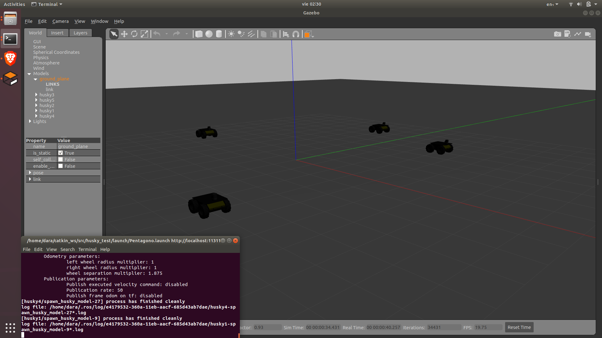
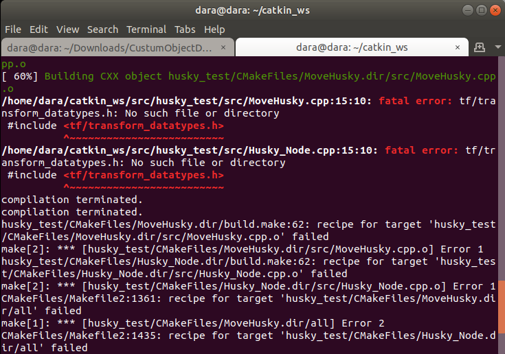

============================
Contexto-ROS
============================

* **Entrenamiento:** `CustumObjectDetection <https://github.com/Daegas/CustumObjectDetection>`_ 
* **Implementación:** `multi_camera_husky <https://github.com/Daegas/multi_camera_husky>`_  

¿Qué es ROS?
=============

En su `página oficial <http://wiki.ros.org/ROS/Introduction>`_ dice:

Es un sistema operativo para robots, incluye abstracción de software, control de bajo nivel, implementación de 
funcionalidades comunes, comunicación de mensajes entre procesos. Proveé librerias para obtener, construir, escribir
y correr código en multiples computadoras.

ROS Tutorials
==============
`TUTORIALES DE ROS <https://wiki.ros.org/ROS/Tutorials>`_ 

Sería bueno darse un clavado por los tutoriales de ROS
para entender más a profundidad el sistema, y tener algunos tips del manejo del mismo.
Pero cuando se entienden estos 2 temas, se tiene una idea a grandes rasgos de como funciona.

* `👁 Nodos <https://wiki.ros.org/ROS/Tutorials/UnderstandingNodes>`_ 
* `👁 Tópicos <https://wiki.ros.org/ROS/Tutorials/UnderstandingTopics>`_ 

Archivos de un robot
=====================

En la parte de instalación obtendremos un paquete que se llama husky_description en este paquete se define
el robot husky, y es esta misma descripción que se usa es husky_test para simular uno o más huskys.
Ambos paquetes  el cuál están conformado por:

* CMakelists.txt 

* config

* include

* launch  

* src 

* urdf

En launch están los archivos necesarios para lanzar un husky, estos toman información de las definiciones
que están en urdf. Si se quiere agregar otro husky a la simulación copiar  pegar el código de lanzar un husky
en launch>Pentagono.launch, modificar el nombre y las coordenadas donde aparece por primera vez para evitar colisión.

::

    roslaunch husky_test Pentagono.launch

.. note:: 
    El argumento para agregar la base con la camara kinect montada se cambió aproximadamente a mediados de 2020 
    en los urdf de *kinect_enabled* a *realsense_enabled*.
    Tomar en cuenta que se tendrá que modificar en el urdf y el .launch .

.. note:: 
    Al hacer catkin_make con husky test sale un pequeño error, que hasta el momento no se ha afectado.
