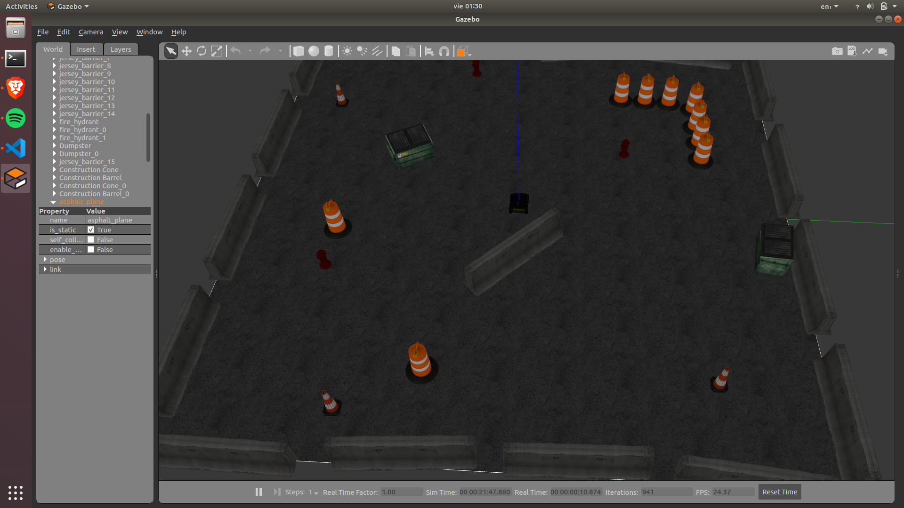
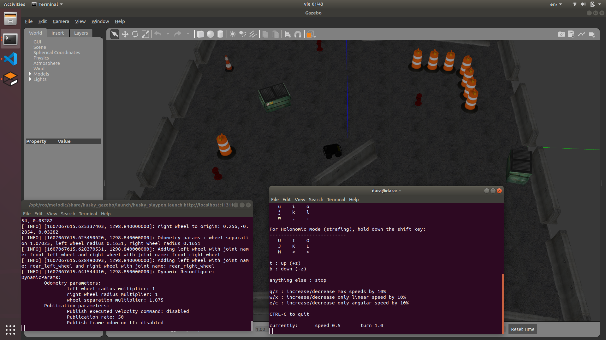
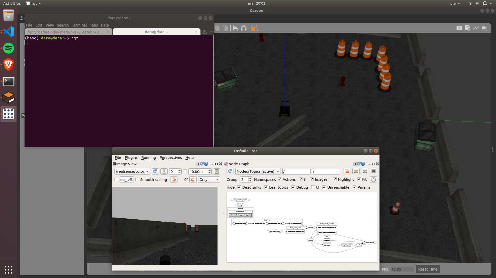

=============================
Instalación-ROS
=============================

* **Entrenamiento:** `CustumObjectDetection <https://github.com/Daegas/CustumObjectDetection>`_ 
* **Implementación:** `multi_camera_husky <https://github.com/Daegas/multi_camera_husky>`_  

Brief Summary
==============

Última actualización: 3/12/2020. 

Pripalmente está basado en `este blog <https://projectsfromtech.blogspot.com/2017/10/visual-object-recognition-in-ros-using.html>`_

Descargar repositorio:
=======================
Descar multi_camera_husky:
::

    cd ~/Downloads
    git clone https://github.com/Daegas/multi_camera_husky
    cd multi_camera_husky

En el repositorio viene un archivo **.sh** con los comandos para instalar:

* ros-melodic-desktop-full
* Algunas dependencias de python
* Paquetes necesarios de husky (description, control, gazebo, viz)
* ros-melodic-teleop-twist-keyboard para controlar los huskys con el teclado
* Crea un workspace.

Este archivo no está probado, se extrajo del historial de bash. Para probarlo:

::

    chmod +x ros-installs.sh
    ./ros-installs.sh

Su contenido es,
en caso de ser necesario correrlo manualmente:

::

    #! /bin/bash   
    sudo sh -c 'echo "deb http://packages.ros.org/ros/ubuntu $(lsb_release -sc) main" > /etc/apt/sources.list.d/ros-latest.list'
    sudo apt-key adv --keyserver 'hkp://keyserver.ubuntu.com:80' --recv-key C1CF6E31E6BADE8868B172B4F42ED6FBAB17C654
    sudo apt update
    sudo apt install ros-melodic-desktop-full
    echo "source /opt/ros/melodic/setup.bash" >> ~/.bashrc
    source ~/.bashrc
    sudo apt install python-rosdep python-rosinstall python-rosinstall-generator python-wstool build-essential
    sudo apt install python-rosdep
    sudo rosdep init
    rosdep update
    sudo apt-get install ros-melodic-husky-description -y
    sudo apt-get install ros-melodic-husky-control -y
    sudo apt-get install ros-melodic-husky-gazebo -y
    sudo apt-get install ros-melodic-husky-viz -y
    sudo apt-get install ros-melodic-teleop-twist-keyboard
    source ./devel/setup.bash
    echo "source /opt/ros/melodic/setup.bash" >> ~/.bashrc
    mkdir -p ~/catkin_ws/src
    cd ~/catkin_ws/src
    catkin_make

Ya que se creo catkin_ws, vamos a mover el repositorio multi_camera_husky

::

    mv -r ~/Downloads/multi_camera_husky ~/catkin_ws/src

Podemos borrar el archivo de instalación:

::

    rm ros-installs.sh

Probar
=======

Para probar la correcta instalación, intenta correr:

::

    roslaunch husky_gazebo husky_playpen.launch

Y este es el resultado:

Controlar
===========

Para poder mover el husky en la simulación, ocupamos el paquete `teleop_twist_keyboard <http://wiki.ros.org/teleop_twist_keyboard>`_

Este paquete publica mensajes en el tópico cmd_vel.

En otra terminal, (no olvides traer la configuración de bash, por cualquier cosa):

::

    source ~/.bashrc 
    rosrun teleop_twist_keyboard teleop_twist_keyboard.py

Este es el resultado, las instrucciones se imprimen en consola:

Más adelante se ocupará modificar el tópico al que publica, pues es uno diferente
para cada husky, esto se logra con:

::

    rosrun teleop_twist_keyboard teleop_twist_keyboard.py cmd_vel:=my_cmd_vel

Es un poco baja la velocidad a la que se mueve, se puede aumentar una vez corrido el
comando con z, pero con este comando se modifica desde el principio:

::

    rosrun teleop_twist_keyboard teleop_twist_keyboard.py _speed:=0.46 

RQT
===

Es una herramienta que permite visualizar e interacturar con varios elementos de ROS. 
Para este proyecto principalmente se usa para visualizar la cámara y los nodos de ROS. 
Mientras en una terminal se está corriendo gazebo, en otra se escribe:

::

    rqt 

Para ver los nodos: *Plugins > Introspection > Node graph* .

Para ver la imagen de alguna cámara: *Plugins > Visualization > Image view* .
