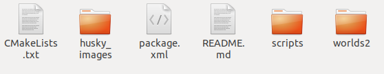

=====================================
Implementación-ROS
=====================================

Hay muchas maneras de implementar, en este caso se estaba buscando una para Ubuntu 16 y Python 2.7:

Fue implementada la de  `este blog 👉 <https://projectsfromtech.blogspot.com/2017/10/visual-object-recognition-in-ros-using.html>`_, 
explican el código, puede servir como base para otro código. El problema que se encuentra es que lee un modelo h5 (formato Keras) y la salida de nuestro entrenamiento es .pub (formato tensorflow) .

.. note:: 
 Al tratarlo de modificar para python 3, se tuvieron problemas con la librería *cv_bridge* que es escencial, pues se encarga de que se pudan leer la imágenes de ROS por cv2.

La idea a grandes rasgos es subscribirse al tópico de cámara del husky, transformar la imagen y pasarla por el modelo de reconocimiento
y crear dos nodos, uno que esté publicando si el husky aparece o no en la imagen y el otro la probabilidad de que aparezca,
con opencv mostrar la imagen con los resultados. 

Archivos multi_camera_husky
==============================

    
Hay 3 directorios importantes:

* husky_images

Aquí se guardan las imagenes capturadas con *scripts > listener_take_pic.py*  

* scripts

- *listener.py* Se subscribe al tópico de la imagen del número de huskys que se le mande en el argumento.
- *lister_take_pic.py* En el argumento recibe <Husky to subscribe> <camera true/false> <train true/false> . (*Ejemplo:* rosrun multi_camera_husky listener_take_pic.py 0 true false Se subscribirá a la camara del husky 0, cada que se presione la tecla espacio se tomará la imagen y se guardará como *1_n* en husky_images/train
- *tryscripts > object-detection-blog.py* El el código implementado del blog mencionado al principio de esta página.

* worlds2

- Aquí vienen algunos mundos que se obtuvieron mayormente de internet con el fin de en algún futuro probar los resultados con diferentes escenarios. Estos se puede incluir en Pentagono.launch

¿Cómo proceder?
=================

Hay 2 opciones para hacer:

* Investigar como se  transforma o guarda en h5. `(Aquí una opción) <https://stackoverflow.com/questions/59375679/tensorflow-pb-format-to-keras-h5>`_
* Investigar como leer modelo .pub e implementarlo en ROS.

 

También se pueden buscar otras alternativas para implementar.
