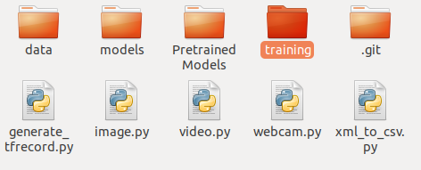

=============================
Ent/Instalación
=============================

Repositorio: `CustumObjectDetection <https://github.com/Daegas/CustumObjectDetection>`_ 

Brief Summary
==============

Última actualización: 6/22/2019 with TensorFlow v1.13.1. 

Pripalmente está basado en
`el repositorio de EdjeElectronics <https://github.com/EdjeElectronics/TensorFlow-Object-Detection-API-Tutorial-Train-Multiple-Objects-Windows-10>`_
y
`el de Khaivdo <https://github.com/Khaivdo/How-to-train-an-Object-Detector-using-Tensorflow-API-on-Ubuntu-16.04-GPU>`__'s
repositories.

.. note:: El desarrollo se hizo con CPU, pues se contaba con una GPU antigua con poca capacidad de computo. Se anunciará que comandos pueden cambiar para diferente versión de Ubuntu o Tensorflow además de algunos links  de ayuda para la instalación y algunos posibles problemas que se prevean.Aquí se usó Tensorflow CPU 1.7

0. Para GPU
============
*Puedes saltar este paso en caso de que quieras usar TensorFlow CPU*
El problema de usar versiones recientes de herramientas, es que muchas
veces no hay mucho soporte aún. La ventaja es que no se necesitará actualización
en más tiempo. 

 

Para que Tensorflow GPU sea soportado en tu computadora tienes que tomar en cuenta:

*Hardware*

* `Los requerimientos de hardware <https://www.tensorflow.org/install/gpu#hardware_requirements>`_

Prácticamente solo es asegurarse que la tarjeta gráfica tenga
disponible CUDA `en esta página <https://developer.nvidia.com/cuda-gpus>`__
y una capacidad de computo >=3.5. En caso de que sea menor a 3.5 
existe la opción de `Build from source <https://www.tensorflow.org/install/source#download_the_tensorflow_source_code>`__
pero eso es un gran reto.

*Software*

`Los requerimientos de software <https://www.tensorflow.org/install/gpu#software_requirements>`__ de la paágina oficial de tensorflow.

Lo más importante es:

#. NVIDIA Drivers
#. CUDA toolkit
#. cuDNN SDK

Si tienes el hardware correcto hay 2 formas de instalar el software:
Por medio de una imagen de Docker o manualmente. En cualquier caso se
tienen que instalar los drivers de NVIDIA.

0.1 NVIDIA DRIVERS
-------------------
Hay dos formas para instalar los drivers:

#. `la página de NVIDIA <https://www.nvidia.com/drivers>`_
#. Con el comando graphics-drivers ppa

Recomiendo primero intentar la primera. Solo es buscar tu GPU y 
descargar al archivo. Después desde el directorio que lo contiene correr::

    sudo sh ./NVIDIA-Linux-x86_64-418.113.run

O el nombre que tenga el archivo.

Para probar la instalación::

    nvidia-smi

En la salida del comando en la  segunda tabla "Processes" el número correspondiente a tu GPU (usualmente 0)
debe de tener un proceso asignado. 

En caso de que no funcione la instalación, probar la segunda opción.
Se tiene que tomar en cuenta que los drivers de NVIDIA sean compatibles
con la versión de CUDA. `En esta tabla <https://docs.nvidia.com/deploy/cuda-compatibility/index.html#binary-compatibility__table-toolkit-driver>`__
se listan los minimos drivers requeridos para cada versión de CUDA.
Como vamos a instalar TensorFlow >=2.1.0 ocupamos CUDA 10.1 y drivers >= 418.x.
También puedes instalar otras versiones de drivers, solo tendrías que asegurarte
de instalar CUDA, CuDNN y TensorFlow correspondientes.
    
`En esta página <https://medium.com/repro-repo/install-cuda-9-2-and-cudnn-7-1-for-tensorflow-pytorch-gpu-on-ubuntu-16-04-1822ab4b2421>`__
en el punto 1 se instalan los drivers via graphics-drivers ppa. Se puede usar como referencia. El paquete para 418 se llama nvidia-driver-418.

::

    sudo apt install nvidia-driver-418 nvidia-settings

con::

    apt-cache search nvidia-driver-

buscas los drivers disponibles para instalar.

`Aquí <https://linuxconfig.org/how-to-install-the-nvidia-drivers-on-ubuntu-20-04-focal-fossa-linux>`__ hay otra página de ayuda.

1.2 CUDA
---------

Una vez que hayas logrado instalar correctamente los drivers, sigue 
instalar CUDA. Asegúrate de encontrar la version de CUDA compatible con
los drivers instalados.

`CUDA Toolkit archive <https://developer.nvidia.com/cuda-toolkit-archive>`__

Para  CUDA <11 no hay versiones para Ubuntu 20.04 pero se puede usar la
versión estable de 18.04.

En caso de tener problemas:

a) Intentar seguir estás instrucciones pero de la segunda forma (from CUDA repository): `How to install CUDA on Ubuntu 20.04 Focal Fossa Linux <https://linuxconfig.org/how-to-install-cuda-on-ubuntu-20-04-focal-fossa-linux>`_

b) `Guía de instalción oficial de CUDA <https://docs.nvidia.com/cuda/cuda-installation-guide-linux/index.html>`__

c) `Quick Start Guide para Ubuntu <https://docs.nvidia.com/cuda/cuda-quick-start-guide/index.html#ubuntu-x86_64>`__

0.3 cuDNN SDK
----------------

Dependiendo de la versión de CUDA que hayas instalado, elige del 

`archivo de cuDNN <https://developer.nvidia.com/rdp/cudnn-archive>`__

la versión correspondiente. Necesitarás crear una cuenta para descargar.

Abien Fred se tomó la molestía de hacer una guía de instalación de
Tensorflow para Ubuntu 20.04. `Installing TensorFlow GPU in Ubuntu 20.04 <https://towardsdatascience.com/installing-tensorflow-gpu-in-ubuntu-20-04-4ee3ca4cb75d>`__
Puedes seguirlo hasta antes de isntalar Tensorflow.

1. Anaconda
=================

Instalar los requerimientos:

::

    sudo apt-get install libgl1-mesa-glx libegl1-mesa libxrandr2 libxrandr2 libxss1 libxcursor1 libxcomposite1 libasound2 libxi6 libxtst6 -y

Descarga el archivo de instalación con estos comandos:

::

    cd  ~/Desktop
    wget https://repo.anaconda.com/archive/Anaconda3-2020.02-Linux-x86_64.sh
    chmod +x Anaconda3-2020.02-Linux-x86_64.sh 

Y ejecuta:

::

    sh Anaconda3-2020.02-Linux-x86_64.sh -y

Ahora que está instalado, puedes borrar el archivo:

::

    rm Anaconda3-2020.02-Linux-x86_64.sh

2. Create and set your environment
==================================

Abre una nueva terminal y debería aparecer *(base)* antes del nombre de usuario.

*En caso de que no, es por qué aún no agarra la configuración. Intentar correr este comando*

::
    
    eval "$(/home//anaconda3/bin/conda shell.bash hook)" conda init 

En caso de que uses una shell diferente, reemplaza *shell.bash* por *shell.<TuShell>* 

Para crear el ambiente (environment), descargamos el archivo spec-list\_tf-cpu.txt disponible `en este link <https://ugtomx-my.sharepoint.com/personal/de_gamasandoval_ugto_mx/_layouts/15/onedrive.aspx?originalPath=aHR0cHM6Ly91Z3RvbXgtbXkuc2hhcmVwb2ludC5jb20vOmY6L2cvcGVyc29uYWwvZGVfZ2FtYXNhbmRvdmFsX3VndG9fbXgvRXBDel9DN2dvdzVBaTdPakQ5VEJjb0FCaTZhR2xJakdTc1V2YzRuNUdqM21kQT9ydGltZT1WOTBMdzhGcjJFZw&id=%2Fpersonal%2Fde%5Fgamasandoval%5Fugto%5Fmx%2FDocuments%2FServicio%2FObjectDetectionEnv%2Fspec%2Dlist%5Ftf%2Dcpu%2Etxt&parent=%2Fpersonal%2Fde%5Fgamasandoval%5Fugto%5Fmx%2FDocuments%2FServicio%2FObjectDetectionEnv>`_
`here <https://ugtomx-my.sharepoint.com/:f:/g/personal/de_gamasandoval_ugto_mx/EpCz_C7gow5Ai7OjD9TBcoABi6aGlIjGSsUvc4n5Gj3mdA?e=VbZKWV>`_ 

Ahora, creamos y activamos el ambiente:

::

    conda create --name tf-cpu --file ~/Downloads/spec-list\_tf-cpu.txt 
    conda activate tf-cpu

.. note:: Aquí se llamo tf-cpu al ambiente, pero se le puede cambiar el nombre. Aún no hay diferencias entre CPU y GPU

Instalar las dependencias:

::

    pip install Cython
    pip install contextlib2 
    pip install pillow 
    pip install lxml 
    pip install jupyter 
    pip install matplotlib 
    pip install pandas 
    pip install opencv-python 
    pip install "git+https://github.com/philferriere/cocoapi.git#egg=pycocotools&subdirectory=PythonAPI"

Instalar version específica de tensorflow:
::

    pip install tensorflow==1.7 

Instalar la más reciente:
::

    pip install tensorflow

.. note:: Aquí se instaló la versión 1.7 siguiendo el repositorio guía. Pero instalar en su lugar la más reciente. Con ese comando también se instala el soporte para GPU.

3. Descargar repositorios
================================

3.1 Este repositorio
-------------------------

Primero crea un directorio en tu Escritorio de preferencia.

:: 

    cd ~/Desktop mkdir ObjectDetection
    git clone https://github.com/Daegas/CustumObjectDetection

3.2 `Tensorflow Object Detection API <https://github.com/tensorflow/models>`__
-------------------------------------------------------------------------------

Esta es la API de Tensorflow para entre otras cosas Reconocimiento de Objetos. Hay varias
ramas de la API, las cuales están dirigidas a diferentes versiones de Tensorflow. La version 1.7 está 
`en esta rama <https://github.com/tensorflow/models/tree/adfd5a3aca41638aa9fb297c5095f33d64446d8f>`__
Si instalaste otra versión de TensorFlow busca el `API correspondiente a la versión <https://github.com/tensorflow/models/releases>`_.

Para descargar una versión específica, tienes 2 opciones:

a) De forma gráfica  una vez estando en la rama click en Clonar o Descargar y extraerla en tu directorio ~/Desktop/ObjectDetection. 

b) O con pura terminal, cambiando a otro commit con su respectivo sha:

::

    cd ~/Desktop/ObjectDetection 
    git clone https://github.com/tensorflow/models
    cd models 
    git reset --hard adfd5a3aca41638aa9fb297c5095f33d64446d8f

3.3 `Model Zoo <https://github.com/tensorflow/models/blob/master/research/object_detection/g3doc/detection_model_zoo.md>`__
------------------------------------------------------------------------------------------------------------------------------------

Cómo podrás imaginar por el nombre es este repositorio puedes encontrar una lista de modelos. Descarga y extrae alguno en PretrainedModels.
Aquí usaremos `ssd\_inception\_v2\_coco <http://download.tensorflow.org/models/object_detection/ssd_inception_v2_coco_2018_01_28.tar.gz>`__

Así debe verse tu directorio:

* *data* Contiene las imagenes de entrenamiento y testeo.

* *models* Contiene el repositorio de la API de tensorflow para detección de objetos y otras cosas más.

* *PretrainedModels* Contiene al menos un modelo que descargaste del model Zoo.

* *training* Contiene el mapa de etiquetas. En este caso solo una: "husky".

* *generate_tfrecord.py* Archivo necesario para entrenamiento, a menos que se agreguen clases, no se modifica. Genera los datos de entrada al modelo.

* *image.py* 

* *xml_to_csv.py* Transforma los xml de labelImg para que puedan ser usados por la librería csv.Un único uso por cada imagen nueva.
.. note:: Si se quieren agregar más imágenes se puede en el directorio *data* pero deben ser etiquetadas usando `labelImg <https://github.com/tzutalin/labelImg>`__. Seguir los pasos del `repositorio de Khaivdo <https://github.com/Khaivdo/How-to-train-an-Object-Detector-using-Tensorflow-API-on-Ubuntu-16.04-GPU#2-build-your-dataset>`__

4. Compilar Protobufs
================================

Protobuf es uno de los estándares para compartir información entre aplicaciones, 
un poco parecido a lo que JSON hace. Es usado por tensorflow para configurar modelos
y parámetros de entrenamiento. Está implementado para varios lenguajes, evidentemente
Python es uno de ellos, para configurarlo necesitamos compilar Protobuf para Python:
.. 
..     cd ~/Desktop/ObjectDetection/models/research protoc
..     object\_detection/protos/\*.proto --python\_out=.
    
El comando anterior crea un archivo *nombre*\_pb2.py por cada archivo *nombre*.proto en
el directorio /object\_detection/protos.

.. .. note:: Tensorflow ocasionalemente agrega nuevos archivos .proto al repositorio. Si te sale un error como ImportError: cannot import name 'something\_something\_pb2' , tendrás que actualizar el comando de protoc para incluir los nuevos archivos .proto 

* 5.1 PYTHONPATH

Para correrlo, necesitas especificar de dónde toma la información.
Así que agrega models/research a tu PYTHONPATH.
Tendrás que hacer esto para cada nueva terminal. O lo puedes agregar
a tu archivo de configuración de la shell
*.bashrc* el cual está en /home y aparece apretando `Ctrl` + `h` 
necesitarás reemplazar ``pwd`` por la ruta absoluta a models/research.

.. ::

..     cd ~/Desktop/ObjectDetection/models/research/
..     export PYTHONPATH=$PYTHONPATH:`pwd`:`pwd`/slim

5. Prueba
============

Hay 2 formar de probar la instalación:
* La sencilla solo con este comando desde ~/Desktop/ObjectDetection/models/research/:
python object\_detection/builders/model\_builder\_tf1\_test.py
Se ve algo así:

.. like this: ADD IMAGE

* Notebook con explicación:

::

    cd ~/Desktop/ObjectDetection/models/research/object_detection
    jupyter notebook object_detection_tutorial.ipynb

Si no se abre directamente el notebook, solo cliquea en el link que aparece en la terminal,
busca enlistado el  object_detection_tutorial.ipynb y lo abres.

.. ::

..                                                     ADD IMAGE

*Esta manera de probar a continuación es tomada del* `repositorio de Edje <https://github.com/EdjeElectronics/TensorFlow-Object-Detection-API-Tutorial-Train-Multiple-Objects-Windows-10>`_ :

Esto abre el script directamente en tu navegador por default y te permite 
ir paso por paso a lo largo del código. Puedes correr cada sección al dar click
en el botón *Run* o *Shift* + *Enter*. Cuando la sección se termina de correr 
la etiqueta “In [ \* ]” a un lado de la sección cambia por un número (e.g. “In [1]”).

(*Nota: Una parte del script descarga ssd\_mobilenet\_v1 model de GitHub
que pesa ~74MB. Esto quiere decir que tomará un tiempo en completar la sección,
se paciente.*)

Una vez que hayas corrido todos los pasos deberías de ver dos imagenes,
etiquetadas al final de la última sección. Si lo ves, ¡entonces todo está funcionando
correctamente! Si no, ve a 
`Appendix <https://github.com/EdjeElectronics/TensorFlow-Object-Detection-API-Tutorial-Train-Multiple-Objects-Windows-10#appendix-common-errors>`__
para ver una lista de errores que se encontrar mientras se preparaba.

(*Nota: Si corriste el notebook completo sin ningún error, pero las
imágenes, no aparecen, intenta ir a 
object\_detection/utils/visualization\_utils.py y comentar las decalraciones import 
al rededor de las líneas 29 y 30 que incluyen matplotlib. Después vuelve a intentarlo.*)
