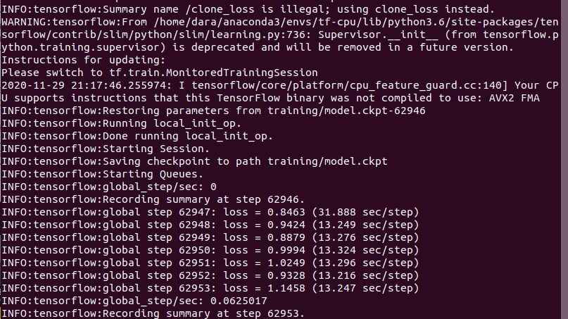
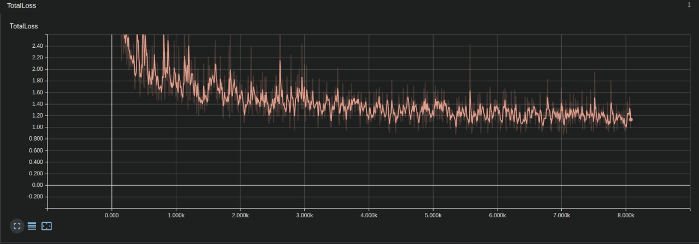
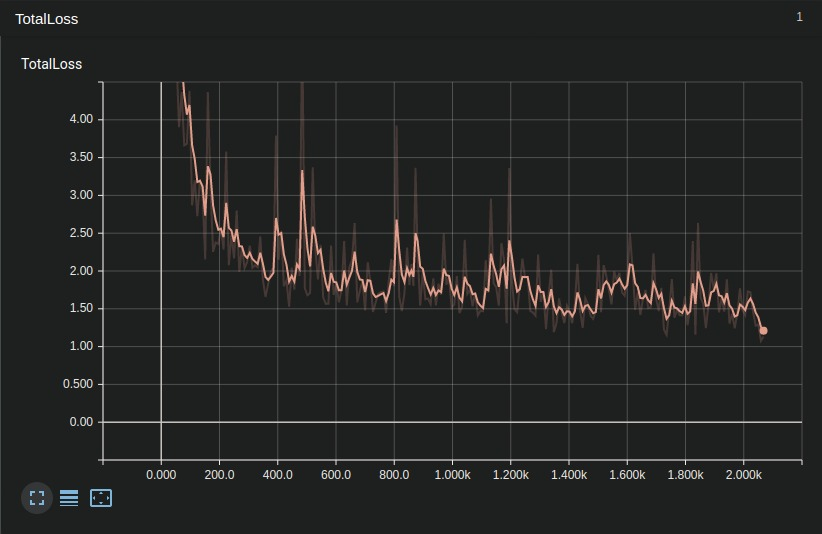

=================================
Ent/Entrenamiento (Ahora sí)
=================================

Repositorio: `CustumObjectDetection <https://github.com/Daegas/CustumObjectDetection>`_ 

1. Generar records de tensorflow
=================================

Basta con correr: 
::

    cd ~/tf-cpu
    python generate_tfrecord.py --csv_input=data/train_labels.csv  --output_path=data/train.record --image_dir=data/train
    python generate_tfrecord.py --csv_input=data/test_labels.csv  --output_path=data/test.record  --image_dir=data/test

2. Configurar los archivos de Object Detection
===================================================

``Minuto 8:33 de`` `🎞️ <https://www.youtube.com/watch?v=0zRsOIp92NQ>`_ .

En el directorio ~/tf-cpu/models/research/object_detection/samples/configs están disponibles los archivos
de configuración base para cada modelo. 

Elige el archivo de tu modelo, copialo al directorio ~/tf-cpu/training. Toma en cuenta:

* Reemplazar 'dara' por tu usuaio y 'ssd_inception_v2_coco_2018_01_28' por el nombre del modelo que descargaste.
* Puede que el número de línea no coincida 
* Los puntos 2-5 los puedes encontrar buscando todos los 'PATH_TO_BE_COFIGURED' del archivo

Lo que tienes que modificar:

1. num_classes:1  *Línea 9* En este caso solo es una.
2. fine_tune_checkpoint: "/home/dara/tf-cpu/PretrainedModels/ssd_inception_v2_coco_2018_01_28/model.ckpt"
3. input_path: "/home/dara/tf-cpu/data/train.record  *Línea 169*
4. input_path: "/home/dara/tf-cpu/data/test.record  *Línea 183*
5. label_map_path: "/home/dara/tf-cpu/data/train.record  *Línea 171 y 185*
6. num_examples: 84 *Línea 175* Este número debe coincidir con las imágenes en el directorio data/training.Puede que se agreguen más depués de terminar esta documentación, verificar el número.

*Opcional* 

7. num_steps: 100000 Esto es el número de pasos que se harán para el entrenamiento, evidentemente, mientras más pasos, más tiempo, Pero también se puede pasar más adelante como argumento.

.. note:: En el directorio ~/tf-cpu/training ya está modificado, solo se tendría que cambiar el nombre de usuario en los PATHS.

3. ¡A entrenar!
================

Desde tf-cpu:

::

    python models/research/object_detection/train.py --logtostderr --train_dir=training/ --pipeline_config_path=training/ssd_inception_v2_coco.config

Puedes pasar el número de pasos como argumento:

::

    python models/research/object_detection/train.py --logtostderr --train_dir=training/ --num_train_steps=50000 --pipeline_config_path=training/ssd_inception_v2_coco.config

Se ve así, pero en tu caso desde el paso 0 y sin la parte de restaurando parametros:

Puedes detenerlo con ``Ctrl`` + ``c`` y al volver a correr el archivo de entrenamiento, retomará en el último checkpoint que encuentre.

4. Tensorboard
===============

``Minuto 34:54 de`` `🎞️ <https://www.youtube.com/watch?v=0zRsOIp92NQ>`_ .

Se explica un poco mejor en `el repositorio de Khavido <https://github.com/Khaivdo/How-to-train-an-Object-Detector-using-Tensorflow-API-on-Ubuntu-16.04-GPU#32-tensorboard>`_ .

Puedes monitorizar el entrenamieto con tensoarboard. Simplemente en otra terminal corre:

::

    tensorboard --logdir=training

5. Exportar 
===============

Del siguiente comando: 
::

    python export_inference_graph.py --input_type image_tensor --pipeline_config_path training/ssd_inception_v2_coco.config --trained_checkpoint_prefix training/model.ckpt-41521 --output_directory trained-inference-graphs/output_inference_graph_v1.pb

Cambiar:

* El nombre del modelo si es necesario
* El número del checkpoint más grande que aparezca en un tu directorio ~tf-cpu/training

Aparecerá el directorio trained-inference-graphs, como se especificó en el comando.

.. note:: 
 En caso de que se haya instalado otra versión de tensorflow, se recomiendo reemplazar el archivo export_inference_graph.py por el que esté en /models/research/object_detection.

.. attention:: Aquí hay algo por investigar, cómo exportar el modelo a formato Keras (h5), pues se almacena con formato de tensorflow (.pb)

`6. Usar el modelo`_
=====================

Ya sea en imagen, video, o cámara del video en el archivo revisar:

* MODEL_PATH *Línea 31* Coincida con el existente
* NUM_CLASSES *Línea 40* Sea 1, en este caso.

Para video:

En la *Línea 68* poner el nombre y extensión del video que debe estar en ~/tf-cpu. Se desacargó `este video de youtube <https://www.youtube.com/watch?v=XRYusHTtaN0>`_ , está disponible `en este enlace <https://ugtomx-my.sharepoint.com/:v:/g/personal/de_gamasandoval_ugto_mx/EdJPz1z1uZpPn4FNys7pwMEBIyhxsACeiOIwrUMMuNz9Ig?e=dg24NX>`_ .

:: 

    python video.py

Para imagen:

En la *Línea 71* poner el nombre de la imgen que debe estar en ~/tf-cpu .

::

    python image.py

Y para cámara:

::

    python webcam.py

7. Resultados 📰
==================
Aquí se enlistan algunos resultados. Se paró el proceso, pues al ser muy lento el entrenamiento en CPU era muy poco conveniente.

#. Resultados al `paso 41521 / 200000  <https://youtu.be/29_qzIE3WtA>`_ . |step-41521|
#. Resultados al `paso 63324 / 200000  <https://youtu.be/r-SI0KqTpcQ>`_ . |step-63324|

En los videos se muestra, el tensorboard, luego se detiene el proceso de tensorboard y el de entrenamiento,
para exportar y correr el modelo en el video de la sección  `6. Usar el modelo`_

.. attention:: Estas pruebas son sin las imágenes  2_27 - 3_178 que se agregaron después al repositorio.

Orden de Imágenes:
--------------------

* 0 _ *x*  | Simulación Husky, SIN cámara, fondo default
* 1 _ *x*  | Simulación Husky, CON cámara, fondo default
* 2 _ *x*  | Descargadas de internet
* 3 _ *x*  | Simulaciones en el playpen (x< 101) y capturas de pantalla (x>=102).

.. Gráficas de TotalLoss de los pasos:

